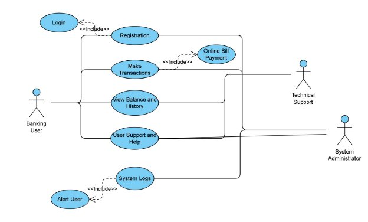

# NM-LICET-GROUP10
# SRS

**1 Introduction**.

**1.1 Purpose**

The Internet Banking Website System serves as a pivotal technological solution designed to meet the ever-evolving needs of our customers and the financial industry as a whole. Its overarching purpose is to provide a secure, convenient, and user-centric online platform that empowers customers to manage their finances efficiently while offering our financial institution a competitive edge. It serves to fulfill various purposes such as Facilitating Financial Transactions, Account Management,Enhanced Customer Experience, Security and Fraud Prevention and Support for Digital Banking Trends.

 **1.2 Document Convention**
- Entire document should be justified
- Times new roman bold 14 for main title
- Times new roman bold 12 for subtitle
- Times new roman 12 for body

 **1.3 Scope of Development**

The scope of the Internet Banking Website project encompasses a comprehensive range of features, functionalities, and deliverables essential to create a cutting-edge online banking platform that meets the needs of our customers and aligns with the goals of our financial institution. This section defines the key aspects of the project's scope:

 **1. User Account Management:**

User Registration: Customers can register and create online banking accounts securely.

Profile Management: Users can update personal information, contact details, and preferences. Account Authentication: Strong authentication methods (e.g., multi-factor authentication) ensure secure user access.

**2. Account Operations:**

Balance Inquiry: Customers can check account balances and view transaction history.

Funds Transfer: Users can transfer funds between accounts within the institution.

Bill Payment: The system supports online bill payments to various service providers.

Check Deposit: Customers can deposit checks electronically through mobile or desktop devices.

**3. Transaction Monitoring:**

Real-time Transaction Updates: Users receive immediate notifications for account activity. Transaction History: Access to detailed transaction histories and statements.

 **1.4 Definitions, Acronyms and abbreviations Definitions:**

<u>Account Holder:</u> An individual or an entity that holds an account with the financial institution.

<u>Transaction:</u> A financial operation, such as depositing, transferring, or withdrawing funds, initiated by an account holder through the Internet Banking Website.

<u>Multi Factor Authentication:</u> A security process that requires users to provide two or more different authentication factors (e.g., password, SMS code) to access their accounts for enhanced security.

<u>Bill Payment:</u> The process of using the Internet Banking Website to pay bills to external service providers, such as utilities or creditors.

<u>User Profile:</u> A collection of personal and account-related information associated with an account holder's Internet Banking Website account.

<u>Session Timeout:</u> The period of user inactivity after which a session on the Internet Banking Website is automatically terminated for security reasons.

<u>Compliance:</u> Adherence to regulatory requirements and industry standards governing the financial services sector.

<u>Application Programming Interface :</u> A set of rules and protocols that allow different software applications to communicate with each other.

**Acronyms and Abbreviations:**

SRS: System Requirements Specification UI: User Interface

UX: User Experience

QA: Quality Assurance

API: Application Programming Interface HTTPS: Hypertext Transfer Protocol Secure JVM: Java Virtual Machine

MFA: Multi Factor Authentication

**2. Overall Description**

**2.1 Product perspective UseCase Diagram**

System:

Online banking application that enables users to perform money transactions from their account, view balance and history of transactions using this application.

Actors:

1. Primary Actors: The primary actor of this application is Banking User as they Register their account details and leverage online banking services available in the application.
1. Secondary Actors: The secondary actors of this application are Technical Support and System Administrator as they provide additional assistance to the application.

The user registers to the application by providing personal details and bank account details. Once the details submitted by the user are verified, the user is authenticated and verified and a copy is saved in the logs which is accessible by the System Administrator. Once authenticated, the user can leverage the features present such as sending money to a bank account, receiving money and viewing the transaction history of the user. If the user faces difficulty in understanding or in using the application, the user can avail the User Support and Help feature within the application wherein a Technical Support gets in contact with the user and guides/instructs on how to use the application.

 **2.2 Product function ER diagram**

The ER Diagram depicts the various entities to be considered when a transaction is initiated. The Bank will be identified by it’s IFSC Code which is unique in nature, each bank will have many accounts related to it. Each account will be identified by it’s Account No, the important thing to be safely guarded is the balance of each account. Each account will be held by a customer. The customer will have an ID and will have the contact details such as their phone number and their address.

 **2.3 User classes and characteristics**
1. **Banking User :** The banking user is the primary user of this system, where he/she will be able to use the system to make transactions and view the same and also the balance of that person’s bank account.
1. **System Administrator :** Any system will need an administrator in order to keep track of the system logs and alert the necessary people if something awry occurs
1. **Technical Support :** There must be a support team to guide the users through their system, they should also be able to view the transactions.

 **2.4 Operating Environment**

The System is used in the environment of any user who signs up for the website, he/she will be in their home environment with proper internet connection in order to access the website. The system will be built considering the various operating environments of the users.

 **2.5 Assumptions and dependencies**

The following will be assumed to be in the possession of the end user

- Proper Internet connection
- A Working PC

 **2.6 Requirements**

**Software configurations**

- JVM
- Internet Browser such as Firefox or Google
- Operating system such as Windows(>7), Linux or MAC

**Hardware Configurations**

- Processor Speed : 2.3 GHz
- Ram : 4 GB
- Wifi Card or Ethernet Port

 **2.7 Data Requirement**

We would require the bank's existing customer details to create the multi-banking system, along with the appropriate protocols to access the data. We would also need the data synchronization between the bank’s database and ours.

**3 External interface requirements**

 **3.1 GUI**
 
 1. **Login Page**
- ` `Clearly labeled text fields for users to enter their username and password.
- ` `Placeholder text within the fields to guide users.
- ` `A prominent button labeled "Login" to initiate the login process.
- ` `A link or button for users to recover/reset their password.
- ` `An option to remember the user's login credentials for future sessions.
- ` `Clear error messages for incorrect login attempts.
- ` `Indication of password strength if applicable.
- ` `A link or button to navigate to the registration page for new users.

2. **Transaction Nexus**
- Display the user's account information, including balance.
- Input field for the deposit amount.
- Deposit button to initiate the transaction.
- Input field for the withdrawal amount.
- Withdraw button to initiate the transaction.
- Display a confirmation message after a successful deposit or withdrawal.
- Clear messages for insufficient funds or other transaction errors.
- Link to view the transaction history.

3. **Transaction History**
- Display a table with Date, Transaction Type, Amount, and Balance After Transaction.
- Allow users to filter and sort transactions based on date, type, or amount.
- If there are a large number of transactions, include pagination controls.
- Provide a search bar to allow users to search for specific transactions.
- Include a link to easily navigate back to the main dashboard.

 **4 System features**
   1. **User authentication and Security:**
- Ensure robust user authentication, including multi-factor authentication (MFA) for added security.
- Use unique user IDs and strong password policies.
- Implement security measures like CAPTCHA to prevent remote digital entry.
2. **Account Monitoring and Management:**
- Allow users to monitor their account activity and transactions in real-time.
- Notify users of any suspicious or high-value transactions via email or SMS.
- Implement account lockout mechanisms for repeated login failures.
- Enable users to set transaction limits and receive alerts for exceeding them.
3. **Privacy and Data Security:**
- Enforce strict privacy controls to ensure that users can only access their own account information.
- Implement encryption for all sensitive data, both in transit and at rest.
- Regularly audit and review security measures to identify and mitigate vulnerabilities.

**5. Other Non-functional Requirements**

1. **Performance Requirement**
- Ensure fast and responsive system performance for online banking activities.
- Implement load balancing and scalability to handle peak usage times effectively.
- Use a robust error handling system to prevent data loss and minimize downtime.
2. **Safety Requirement**
- Implement regular data backups and disaster recovery plans to prevent data loss.
- Ensure uninterrupted service with UPS/inverter systems during power outages.
- Have a plan for handling security incidents, including virus attacks.
3. **Security Requirement**
- Use a secure database system with strong access controls.
- Enforce role-based access control to limit users' access rights based on their roles.
- Implement intrusion detection and prevention systems to detect and respond to security threats.
- Regularly update and patch the system to protect against vulnerabilities.
4. **Requirement attributes**
- Ensure the Internet Banking System is compliant with relevant regulations and standards.
- Provide user-friendly interfaces and comprehensive user manuals.
- Ensure easy installation and updates for users.
5. **Business Rules**
- Enforce strict adherence to banking regulations and policies.
- Define cost structures, fees, and discount offers clearly for users.
- Educate users about security best practices and the consequences of violating rules.
6. **User Requirement**
- Users include account holders, administrators, and customer support staff.
- Account holders should have a user-friendly interface for managing their accounts.
- Administrators should be equipped to manage user accounts and system maintenance.
- Customer support staff should have tools for assisting users and resolving issues.

**6.0 Class diagram**

- The **Bank DAO** class is the Data Access Object class that contains common methods to all actors of the system that fetches required data from the Database. Interacts with Client, Admin and Technical Support classes
- The **Client** and **Admin** classes capture data from respective users from the front-end wherein CRUD operations are performed and response is sent back. Interacts with Bank DAO and KYC classes.
- **KYC** is a support class for the Client class that helps with client registration and authentication details.
- **Technical Support** class is for the supporting actor enabling limited access to Client information that helps in guiding and supporting the client actor.
